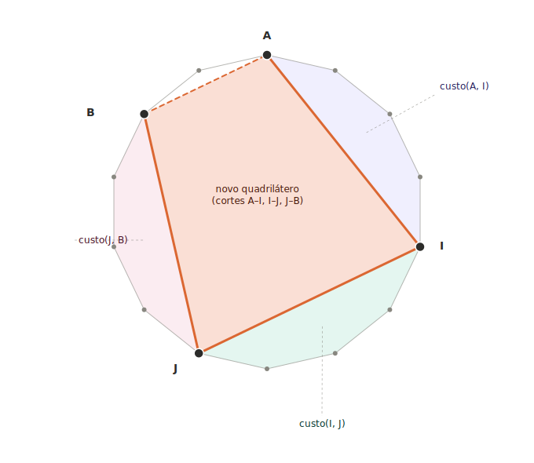
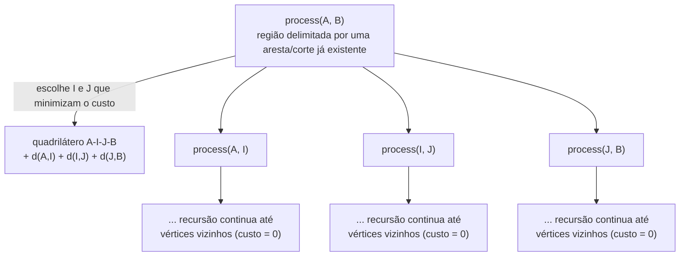
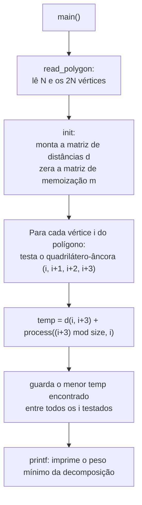

# 9th Marathon of Parallel Programming (WSCAD 2014), Problema C: Minimum Weight Polygon Decomposition

> Este documento **não** é o relatório de paralelização pedido pela disciplina.
> Ele serve apenas para registrar, de forma clara, o entendimento conceitual do
> problema e de como o código sequencial fornecido pela maratona o resolve —
> uma base para discutirmos depois, em outro documento, a estratégia de
> paralelização.

## 1. O que o problema pede, em termos simples

Você provavelmente já conhece o problema clássico de **triangulação mínima de
polígono** (*minimum-weight triangulation*): dado um polígono convexo, você o
divide inteiramente em triângulos traçando diagonais internas, e quer que a
soma dos comprimentos dessas diagonais seja a menor possível.

O Problema C é a **mesma ideia**, porém trocamos triângulos por
**quadriláteros**:

- Em vez de um polígono com *n* vértices virando *n-2* triângulos com *n-3*
  diagonais, aqui um polígono com **2N vértices** vira **N-1 quadriláteros**
  usando **N-2 cortes** (diagonais).
- É por isso que o polígono precisa ter um número **par** de vértices — cada
  corte novo "consome" vértices em pares.

O objetivo é encontrar o **peso mínimo** dessa decomposição, isto é, a soma
dos comprimentos dos N-2 cortes escolhidos, dentre todas as formas possíveis
de decompor o polígono em quadriláteros.

## 2. A intuição central: programação dinâmica

Se já existe um "lado" (uma aresta real do polígono, ou uma
diagonal já traçada em uma chamada anterior) ligando o vértice **A** ao
vértice **B**, e entre eles — andando pela borda do polígono — existe uma
sequência de vértices, queremos saber:

> Qual é o custo mínimo para decompor esse pedaço de polígono (de A até B) em
> quadriláteros?

Chamamos isso de `custo(A, B)`. Para calculá-lo, testamos **todas as formas
possíveis de montar o primeiro quadrilátero que usa A e B como dois de seus
quatro cantos**. Ou seja, escolhemos dois outros vértices **I** e **J** (entre
A e B, na ordem em que aparecem ao longo da borda) e dizemos: "o quadrilátero
A-I-J-B é uma das peças da decomposição". O resto do polígono — o pedaço de A
até I, o pedaço de I até J, e o pedaço de J até B — ainda precisa ser
decomposto, e isso é resolvido **recursivamente** pela mesma função:

$$
custo(a,b) = \min_{i,\,j} \Big[ custo(a,i) + custo(i,j) + custo(j,b)+ d(a,i) + d(i,j) + d(j,b) \Big]
$$

onde `d(x, y)` é a distância euclidiana entre os vértices `x` e `y`:

$$
d(i,j) = \sqrt{(x_i - x_j)^2 + (y_i - y_j)^2}
$$

O **caso base** da recursão é quando A e B já são vértices vizinhos no
polígono original — nesse caso não há nada para decompor, e `custo(a,b) = 0`
(é simplesmente uma aresta já existente, não uma diagonal nova).

O diagrama abaixo mostra visualmente uma chamada `process(A, B)`: os dois
vértices escolhidos I e J fecham um novo quadrilátero (em laranja, com os
três cortes novos em linha sólida), e as três regiões restantes (roxo,
verde-água e rosa) viram três sub-chamadas recursivas independentes.

- **Linha tracejada A–B**: a "moldura" já dada dessa chamada — um lado real do
  polígono ou uma diagonal herdada de uma chamada anterior. Não é uma decisão
  nova.
- **Linhas sólidas A–I, I–J, J–B**: os cortes novos que fecham o quadrilátero
  escolhido nesta chamada. Seus comprimentos entram na soma do custo.
- **As três regiões coloridas**: o que sobra do polígono depois de "tirar" o
  quadrilátero. Cada uma vira uma chamada recursiva independente —
  `custo(A,I)`, `custo(I,J)` e `custo(J,B)` — que, por sua vez, vai escolher
  seus próprios pontos internos de corte.

O algoritmo testa **todas** as combinações possíveis de I e J e fica com a que
minimiza a soma total. A árvore de recursão fica assim:

## 3. Por que os laços avançam de 2 em 2

No código, os laços que buscam candidatos a `i` e `j` avançam em passos de
**2** (`i = (i + 2) % size`). Isso não é acidental: cada quadrilátero consome
um número **par** de vértices do contorno. Para que todo sub-polígono gerado
pela recursão também seja decomponível em quadriláteros (nunca sobrando um
pedaço com número ímpar de vértices, que não fecha em quads), os pontos de
corte I e J precisam manter essa paridade em relação a A. É um detalhe de
implementação que garante que a recursão só gere sub-polígonos "válidos".

## 4. Passo a passo pelo código sequencial fornecido

O código em C usa uma `struct polygon_t` com:

| Campo | Significado |
|---|---|
| `size` | número total de vértices = `2 * N` |
| `x`, `y` | coordenadas de cada vértice |
| `d[i][j]` | distância entre os vértices `i` e `j` (pré-calculada em `init`) |
| `m[i][j]` | memoização de `custo(i, j)`; `-1` quando ainda não calculado |

Alguns pontos que vale destacar:

- **`init()`** define `d[i][j] = 0` quando `i` e `j` são vértices vizinhos no
  polígono original. Isso não significa "distância física zero" — é um truque
  de modelagem: como esse lado já existe (não é um corte novo), ele não deve
  contar no custo.
- **`process(a, b, p)`** é a função recursiva de `custo(a, b)` descrita na
  seção 2. A checagem `if (p->m[a][b] >= 0) return p->m[a][b];` é exatamente
  a memoização: se esse subproblema já foi resolvido antes (por qualquer
  chamada anterior, vinda de qualquer rotação `i` do laço principal), reusa o
  resultado em vez de recalcular.
- **O laço em `main()`** testa, para cada vértice `i`, o quadrilátero "âncora"
  formado por 4 vértices consecutivos `(i, i+1, i+2, i+3)`. O único corte novo
  desse quadrilátero é a diagonal que fecha `i` com `i+3`; os outros três
  lados já são arestas do polígono original. A partir daí, `process` resolve
  recursivamente o restante do polígono (tudo que sobra entre `i+3` e `i`,
  contornando o polígono). Como não se sabe de antemão qual é o melhor ponto
  de partida, o código testa **todas as rotações possíveis** e fica com a de
  menor custo total:

$$
\text{resposta} = \min_{i \,=\, 0}^{2N-1} \Big[\; d\big(i,\; (i+3) \bmod 2N\big) \;+\; custo\big((i+3) \bmod 2N,\; i\big) \;\Big]
$$

## 5. Complexidade computacional

Sendo `n = 2N` o número total de vértices:

- Existem O(n²) subproblemas distintos `(a, b)` (pares de vértices).
- Cada subproblema testa O(n²) combinações de `(i, j)` antes de escolher a
  melhor.
- Como a memoização garante que cada `(a, b)` só é calculado uma vez (mesmo
  sendo revisitado por chamadas de diferentes rotações no laço principal), o
  custo total do preenchimento da matriz `m` é da ordem de **O(n⁴)**, com
  **O(n²)** de espaço para as matrizes `d` e `m`.

Isso é significativamente mais caro que a triangulação triangular clássica
(O(n³), com apenas 1 vértice extra escolhido por chamada). É justamente esse
custo alto que torna o problema um bom candidato à paralelização — o
preenchimento de `m[a][b]` tem dependências (subintervalos menores precisam
ser resolvidos antes dos maiores), então a estratégia de paralelização
provavelmente vai explorar isso: paralelizar por "diagonais" de tamanho
crescente da matriz `m`, e/ou paralelizar o laço duplo de busca de `(i, j)`
dentro de cada chamada de `process(a, b)`.

*(A estratégia de paralelização em si, com os speedups obtidos, será tratada
no relatório separado pedido pela disciplina.)*
